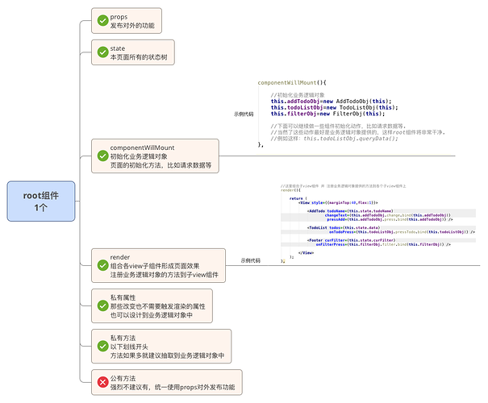
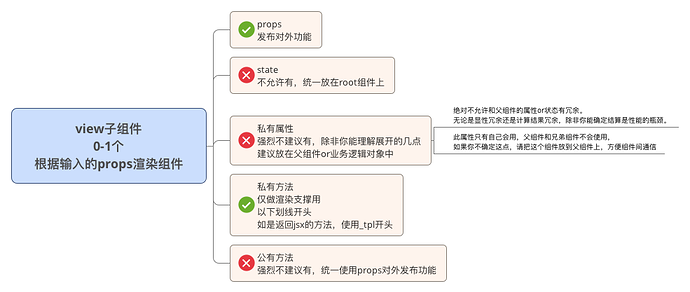
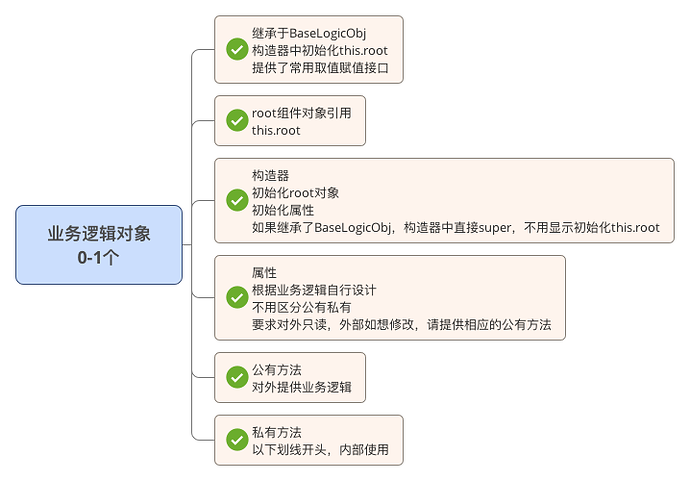

## commands

* <table>
<tr><td>init<appName></td><td>init a webapp</td></tr>
    <tr><td>start[options]</td><td>starts the webserver</td></tr>
    <tr><td>run-ios[options]</td><td>builds your app and starts it on ios simulator</td></tr>
    <tr><td>run-android[options]</td><td>builds your app and starts it on a connected Andriod emulator or device</td></tr>
    <tr><td>new-libray[options]</td><td>generates a native library bridge</td></tr>
    <tr><td>bundle[options]</td><td>builds the javascript bundle for offline use </td></tr>
    <tr><td>unbundle[options]</td><td>builds the javascript "unbundle" for offline use </td></tr>
    <tr><td>link[options][packageName]</td><td>links all native dependencies</td></tr>
    <tr><td>unlink[options]<packageName></td><td>unlink native dependency</td></tr>
    <tr><td>upgrade[options]</td><td>upgrade your app's template files to the latest version; run this after updating the react-native version in your package.json and running npm install</td></tr>
    <tr><td>log-andriod[options]</td><td>starts adb logcat</td></tr>
    <tr><td>log-ios[options]</td><td>starts IOS device syslog tail</td></tr>
  </table>

  ## ReactNative组件\页面架构设计  
http://react-china.org/t/reactnative/3486

一个独立完整的组件\页面一般由以下元素构成：

* root组件，1个，
负责初始化state
负责提供对外props列表
负责组合子view组件形成页面效果
负责注册业务逻辑对象提供的业务逻辑方法
负责管理业务逻辑对象

* view子组件，0-n个，
根据props进行视图的渲染

* 业务逻辑对象，0-n个，
提供业务逻辑方法

### root组件

root组件由以下元素组成：

props-公有属性
state-RN体系的状态,必须使用Immutable对象
私有属性
业务逻辑对象的引用-在componentWillMount中初始化
私有方法-以下划线开头，内部使用or传递给子组件使用
公有方法【不推荐】，子组件和外部组件都可以用，但不推荐用公有方法来对外发布功能，破坏了面向状态编程，尽可能的使用props来发布功能

### 子view组件

子view组件中包含：

props-公有属性
私有属性-强烈不建议有，除非你能理解以下几点，建议放在父组件or业务逻辑对象中
绝对不允许和父组件的属性or状态有冗余。无论是显性冗余还是计算结果冗余，除非你能确定结算是性能的瓶颈。
此属性只有自己会用，父组件和兄弟组件不会使用，如果你不确定这点，请把这个组件放到父组件上，方便组件间通信
私有方法-仅作为渲染view的使用，不许有业务逻辑
公有方法【不推荐，理由同root组件】

### 业务逻辑对象

业务逻辑对象由以下元素组成：

root组件对象引用-this.root
构造器-初始化root对象，初始化私有属性
私有属性
公有方法-对外提供业务逻辑
私有方法-以下划线开头，内部使用

<h5>ps1：通用型组件只要求尽量满足上述架构设计</h5>

通用型组件一般为不包含任何业务的纯技术组件，具有高复用价值、高定制性、通常不能直接使用需要代码定制等特点。

可以说是一个系统的各个基础零件，比如一个蒙板效果，或者一个模态弹出框。

架构的最终目的是保证系统整体结构良好，代码质量良好，易于维护。一般编写通用型组件的人也是经验较为丰富的工程师，代码质量会有保证。而且，作为零件的通用组件的使用场景和生命周期都和普通组件\页面不同，所以，仅要求通用组件编写尽量满足架构设计即可。

<h5>ps2：view子组件复用问题</h5>

抛出一个问题，设计的过程中，子组件是否需要复用？子组件是否需要复用会影响到组件设计。

需复用，只暴露props，可以内部自行管理state【尽量避免除非业务需要】
不需复用，只暴露props，内部无state【因为不会单独使用，不需要setState来触发渲染】
其实， 一般按照不需复用的情况设计，除非复用很明确，但这时候应该抽出去，变成独立的组件存在就可以了，所以这个问题是不存在的。
