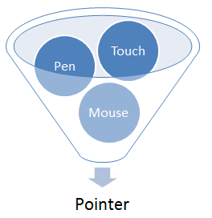
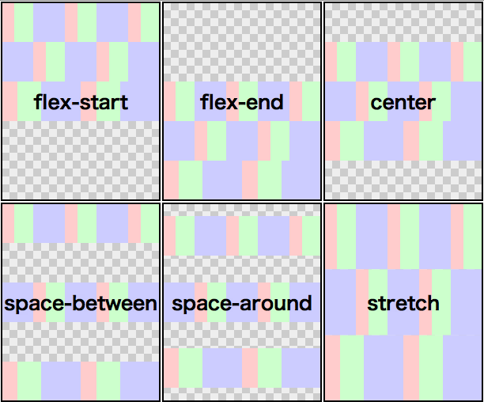
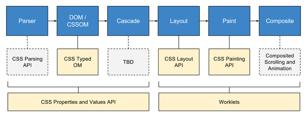

# 前端概论
## 编程语言：总论
编程语言并不都是平等的，用来暴露操作系统 API 的语言总是位于核心（我称为核心语言）。
其它的语言，最终都需要桥接到这种语言才能实现系统相关的功能（纯内存计算则不必）。
* Windows、Linux：C
* iOS、Mac OS：Objective-C，C
* Android：Java，C
* Web 浏览器：JavaScript，WebAssembly
编程语言的实现或移植并不困难，所以核心语言以外的其它选项总是很多。例如，Java、Dart、Cloujre 等都可以编译为 JavaScript。
但是，操作系统的最新功能或底层接口往往只以核心语言的形式提供，所以有一定的了解是必要的。

##　编程语言：JavaScript 的范围
前端领域的一个经典误解是把 JS 的概念“扩大化”了，包括了 DOM 等平台 API，甚至 jQuery 等。实际上 JS 只包括以下部分：
* 数据类型：基本类型，对象，函数等。
* 程序结构：表达式，语句，控制流，函数，异常，类，模块等。
* 标准库：Object，Math，Number，Date，Array，RegExp, Error, JSON, Map, Set, Promise, Typed Arrays, SIMD, decodeURI(), parseInt(), eval() 等。
https://developer.mozilla.org/zh-CN/docs/Web/JavaScript

## 编程语言：不属于 JavaScript 的东西
JS 的标准库很小，Java、C# 等标准库的很多功能都没有，如文件、网络、GUI等。不属于JS的API举例：
* setTimeout()/setInterval() （HTML 标准）
* DOM: Document, Element, NodeList, event （DOM 标准）
* XMLHttpRequest （独立标准）, fetch API (独立标准)
* Worker （现为 HTML 标准，有人提议加入ES标准）
* localStorage （HTML 标准）
不属于 JS 的东西，出了浏览器就不一定有了。上述API 在 node.js 中，除了 setTimeout()/setInterval()，其它的都没有。

## 编程语言：JavaScript 的值得关注的新玩具
* Promise （ES2015）和 async + await（ES2017?）：避免让人头疼的回调。
* class（ES2015）：更直观和流行的面向对象风格。
* const, let（ES2015）：局部作用域，避免重复声明、解决循环+闭包问题。
* Typed Arrays（ES2015）：高效的整数、浮点数数组。可以用于 WebGL、WebAudio、图像处理等。
* SIMD （ES2017?）：利用CPU的向量计算单元极大地提高数值计算速度。
* 共享内存和原子操作/shared memory, atomics（ES2017?）：实现 Web Worker 间的高效数据共享，等效于多线程。
* 弱引用 / Weak Reference（?）：可实现能自动回收的缓存。

## 编程语言：WebAssembly
WebAssembly 是 Web 平台上首个标准化的、除了 JS 之外的编程语言。主要特点是：
1. 是类似 Java 或 .net 字节码，适合作为 C/C++ 等非 GC 语言的编译目标，方便移植。将来会支持 GC 型语言的移植。
2. 性能尽可能高，接近原生代码。与 JS 相比，主要是静态语言对动态语言的优势。
3. 代码尽可能小，能被高效压缩，节约网络流量。与 JS 相比，采用二进制编码。
4. 比 JS 支持更多数据类型，特别是真正的整型（int32, int64）。
5. 一次编译，到处运行，与CPU无关。
6. 安全。不存在未定义行为，指针越界受限，所有的异常都可捕获。不过不如JS安全。
7. 近期会增加 SIMD 指令。这一点领先了Java、.net 甚至 C/C++。
8. 近期会增加共享内存和原子操作。这是实现抢占式多线程的基础。
编程语言：WebAssembly
现状：Chrome 和 Firefox 刚刚发布（2017.3），Edge 和 Safari 在开发中。
http://caniuse.com/#search=wasmhttp://webassembly.org/
编程语言：WebAssembly —— 简单的例子: http://webassembly.org/docs/text-format/

## 图形用户界面：总论
在操作系统和基础库的层面上，图形用户界面是个很复杂的东西。高性能、可移植、易开发等要求很难同时满足。在现代操作系统上，图形用户界面系统应包括以下部分：图形用户界面：总论
* 窗口管理（指顶级窗口）：窗口的移动、叠放、缩放、透明、弹出菜单等效果。
* 用户交互输入：主要指鼠标、触摸、键盘、输入法等。
* 布局管理：窗口内控件或单元的布局，自动响应窗口尺寸变化，内容修改。
* 文本的排版与显示。（富）文本编辑。
* 二维/三维矢量图形。
* 图像、音视频的播放和编解码，音效处理。
* 剪贴板。
* 摄像头、麦克风。
* 打印。
目前，除了第一条以外，Web 平台在图形用户界面方面是比较完善的。窗口管理还是由宿主操作系统代管，而Chrome OS 和 Firefox OS 都各自开发了窗口管理器。

## 用户交互输入：指点设备
重点：
* 低层事件（mouse*, touch*, pointer*）已经标准化
* 高层事件（click, tap, press, swipe, pan, zoom, rotate, manipulate）大多未标准化，可以用一些库（hammer.js）
* 事件冲突的处理（scroll-pan, click-pan）。工具：touch-action CSS 属性；trueclick.js（自制）。

* https://w3c.github.io/pointerevents/
* 建议用 Pointer Events 综合处理鼠标和触摸事件。

## 用户交互输入：键盘事件、输入法事件、焦点事件

键盘事件：keydown, keyup。有焦点的元素才可收到键盘事件。是低层事件，可在几乎任意元素上产生。注意在较新的浏览器中可用 KeyboardEvent.key 而不是 .keyCode 来获得具体按键。
焦点事件：focus，blur, focus in, focus out。焦点控制：tabindex 属性。
输入法事件：compositionstart, compositionupdate, compositionend。输入法事件只在可编辑元素上产生。
输入事件：input, change
掌握好焦点的处理和键盘事件的产生顺序是关键。
用途：大部分简单应用程序只需要处理 change 或 input 事件。键盘事件、焦点事件、输入法事件用于实现快捷键和较复杂的编辑功能。

用户交互输入：键盘事件、输入法事件、焦点事件这些都在 UI Events 规范中定义：https://w3c.github.io/uievents/

## 布局管理
这里的布局是指相对宏观的元素的布局，不包括文本的布局。
Web 平台上的布局管理基本只有一个选择：CSS。为什么 JS 不适合？因为没有接口能去预测（注意不是显示后测量）元素的尺寸。
例如：怎样知道这个元素的大小：
Hello Javascript曾经 CSS 的布局管理很薄弱，只有 table, margin, float, position 这少数几种“不专业”的武器。说不专业，是因为它们原本不是为布局设计的。所以除了特殊情况，只能把布局用 CSS 以描述的方式（而不是命令的方式）写出来。不过 JS 在布局管理中也不是全无作用，例如 window.onresize 事件就无法完全用 CSS 代替。另一个例子：弹出式菜单如何避让窗口边界？

## 布局管理利器：CSS flex

https://www.w3.org/html/ig/zh/wiki/Css3-flexbox/zh-hans
建议新入坑的同事直接学 flex 布局，忽略 float 和 table（table 请只用于真正的表格）。
根据备课大师开发的经验，flex可满足现阶段大部分 UI 布局需求。浏览器支持是 IE10+ （但需要注意其bug）。不需要支持旧IE的项目均可考虑采用。

http://caniuse.com/#search=flex
https://github.com/philipwalton/flexbugs

## 布局管理的新星：CSS grid
https://css-tricks.com/snippets/css/complete-guide-grid/
CSS grid 提供了一个虚拟的网格，你可以将元素放进去，占据一组邻接的单元格（限于矩形）。

浏览器支持：IE11+，Chrome 57+, Firefox 52+，Safari 10.1+。这次是微软领先。
对我们的具体情况来说，上述浏览器除了Firefox52，都不支持XP；CEF 因为要支持 XP，所以不能选 49 以上版本；Android WebView 和 Crosswalk 暂时也不支持；因此应用上会有一定的困难，但也可以用polyfill。
<a href = "https://github.com/FremyCompany/css-grid-polyfill/">grid polyfill</a>

## 布局管理：不仅要好，还要快 —— CSS contain
https://drafts.csswg.org/css-containWeb
平台的 GUI 性能仍落后于最好的原生框架，其中一个原因可能是 CSS 布局的全局性：修改任意位置的内容或样式，理论上都可能影响整个页面的布局，因此浏览器往往要做很多额外的来计算更新后的布局。在过去，只有 iframe 可实现完全的隔离。未来我们可以使用 CSS contain 属性，将一个元素隔离起来，确保对其内部的修改不会影响外界。

## 布局管理的革命：用 JS 来实现 CSS
到最近为止，几乎一切 CSS 特性都只能由浏览器的原生代码来实现，客户的 JS 代码是插不上手的。
这与 JS 有很大的不同：很大一部分 ES 2015/2017 特性是可以用 ES5 甚至 ES3 来实现的（Babel 编译器）。
因此，CSS 新特性的 polyfill 很难写。
很快这种状况将会有改变，CSS Houdini 项目将会引入一组 JS API，允许 JS 介入浏览器的 CSS 计算过程，从而允许用 JS 来实现自定义的 CSS 特性。在布局方面，Web 将很快赶上并超越原生平台。

<a href = "https://zhuanlan.zhihu.com/p/20939640#!">参考：《Houdini：CSS 领域最令人振奋的革新》</a>

##文本和字体
要点：
* 正确使用单位（em, rem, px, 百分比），让元素尺寸和字号匹配且可变。
* 正确使用字体名回退机制，不要只写一个“微软雅黑”，适应多种操作系统。
* 掌握 letter-spacing, word-spacing, line-height 等格式机制。
* 了解 @font-face 和内嵌字体。对中文页面来说，最主要的用途是“字体图标”。
http://www.iconfont.cn/http://fontawesome.io/icons/

## 图像
要点：
* 了解不同压缩格式的特点和适用范围。图标应该用png还是jpeg，还是svg？
* 注意图像的大小，因为直接影响性能。对大小有个大致的经验，如100万像素的 jpeg 一般不超过300KB。使用图像压缩/优化工具（imagemin等）。
* 掌握 Sprite 图标的做法，减少文件数量/网络请求。如果可能，用字体图标代替。
进阶：
* 图像迟加载。注意立即触发下载，即使不可见甚至孤立。
* 自适应父元素的大小：CSS object-fit （MS家尚不支持，有polyfill）
* 背景缩放和裁剪：CSS background-position, background-size
* 特效：CSS filter, mask
* 适应高分辨率屏幕：, <picture>
* 大尺寸动图：用 video 代替 gif（压缩效率提高）。

## 图形
不同的技术方向
* CSS：border (圆角和部分隐藏), gradient（多重）, transform(2D/3D), clip, shape（新）。局限性较大，考验技巧和想象力，但与 HTML 结合的好。
* SVG: 直观，完备，工具支持好（illustrator, inkscape）但内容庞杂。
* Canvas2D: 立即模式绘图（SVG是保留模式）。适用于快速变化的场景，如游戏。顺便一提，原生GUI程序大都是建立在立即模式绘图API的基础上的，例如GDI。
* Canvas3D: WegGL，也属于立即模式。
如果想要深入研究图形，需要了解一些计算机图形学（2D较简单，3D相当难）。
动画
* CSS 和 SVG：Transition, Animation，Web Animations。描述式，使用简单，性能不总是稳定。
* Canvas：通过重画实现，性能可预测，但需要注意优化。

## 音视频
要点：
* 了解音视频格式的基础知识：容器格式，视频编码，音频编码，码率，分辨率，颜色格式，采样率。工具：MediaInfo。https://mediaarea.net/zh-CN/MediaInfo
* 了解一种音视频转码工具。推荐 ffmpeg（命令行，GUI工具实在找不到好用的）。
* 掌握浏览器对媒体格式的支持情况（注意 CEF 的特殊性）。http://caniuse.com/#search=video
* （进阶）Media Source Extensions：允许支持不同的容器格式，如 flv (flv.js)，mpeg-dash, http live streaming。
<a href = "https://dev.opera.com/articles/everything-you-need-to-know-html5-video-audio/">《Everything You Need to Know About HTML5 Video and Audio》</a>
<a href = "https://msdn.microsoft.com/en-us/library/dn551368%28v=vs.85%29.aspx?f=255&MSPPError=-2147217396">《Building a simple MPEG-DASH streaming player》</a>

## 其它GUI相关功能
* 剪贴板：copy, cut, paste 事件，DateTransfer 接口。
* 摄像头和麦克风：MediaDevices.getUserMedia()。
* 音频处理与合成：Web Audio API。
https://developer.mozilla.org/en-US/docs/Web/API/Web_Audio_API
https://developer.mozilla.org/en-US/docs/Web/API/MediaDevices/getUserMedia

## 网络
操作系统暴露给原生应用的接口一般是传输层的（socket），特殊情况下也可以访问网络层（raw socket）和数据链路层（通过内核模块）。

TCP/IP协议簇分层详解
浏览器暴露给web应用的接口一般是应用层的（HTTP，WebSocket, WebRTC），仅有特权应用可以访问传输层[1]。这意味着一般web应用无法实现：
* 得知自己和对端的IP地址。
* 服务器（HTTP ，IMAP等）。
* 点对点通信协议（BitTorrent）。
不过，桌面web运行环境是可以的，如Electron, NW.js（通过node.js），XULRunner等。
[1] https://www.w3.org/TR/tcp-udp-sockets/

## 网络-HTTP
要点：
* 基本数据结构：请求-响应，消息（头/体）。
* 与TCP的关系：消息边界的确定（content-length, transfer-encoding: chunked），连接开销，持续连接，错误处理，超时（数据超时和连接超时），取消，半双工和全双工。
* 方法：GET, POST, PUT, HEAD, OPTIONS, DELETE
* 响应码。
* 重定向。
* 缓存：本地缓存和网络缓存；新鲜度和验证；可缓存性；控制缓存的行为。
* Cookie
* multipart/form-data 格式：与POST的关系。
* HTTPS
* HTTP2
* CDN 和 DNS
* 研究工具：Wireshark（抓包工具），node.js（写一个实验用服务器）

## 网络-HTTP-浏览器相关
同源规则
* 不是 HTTP 协议的一部分，而是浏览器的安全机制。非浏览器环境（node.js, java, .net）无此限制。
* 主要针对 XMLHttpRequest 这类的脚本发起的请求，不限制静态内容的访问（<script>、、<link>、background-image、<form>）。
* 针对的攻击类型：用户在网站2处于登录状态，打开网站1，网站1以用户的身份访问网站2的接口。
* 放松限制的方法：跨站资源共享（CORS），JSONP。
Web API
* XMLHttpRequest：仅支持文本和XML
* XMLHttpRequest2: 还支持二进制数据、FormData
* Fetch API：简化语法，支持流
* <form>

## 网络-HTTP-浏览器相关
缓存、拦截、离线
* AppCache：允许缓存和离线使用网页，已经过时。
* Service Worker：拦截和响应全部 HTTP 请求（仅限同源），如同一个本地 Web 服务器。
* Cache API：帮助 Service Worker 缓存源站数据。与浏览器缓存不同，不会被自动清理，而是由脚本控制。
浏览器支持情况：Chrome40，Firefox44，Android WebView 53，Edge15。Apple 家不支持。
注意：Service Worker 只能在 https 网站上使用。这是为了降低中间人攻击的风险。
长连接消息流
* Server Sent Event (SSE)：服务器向客户端不定期推送消息。优点是及时，开销小，缺点是单向。已经成功用于互联课堂。

## 网络-HTTP以外
* WebSocket：全双工流式协议，需要自定义消息结构，类似原生应用中的 TCP Socket。服务器需要特殊支持才行。有观点认为它会被 HTTP2 取代。
* WebRTC：实际上使用了多种基于UDP的协议（DTLS，SCTP，SRTP，SDP）。不过，WebRTC暴露的接口比较高层，可定制性不强，主要适用于点对点的视频通话等应用。
<a href = "https://hpbn.co/webrtc/">WebRTC</a>

## 本地存储
分类
* 按可访问的范围：隔离的（受同源规则保护）和共享的（如操作系统的文件系统）。
  目前标准化的只有隔离的本地存储。共享的本地存储通常有安全上的担忧。
* 按数据结构和接口：关系数据库、键值对数据库、文件系统。
  目前标准化只有键值对数据库。
API
* <input type=file> ：拾取操作系统上的文件。
* <input type=file webkitdirectory> ：拾取操作系统上的整个目录。目前 Chrome，Edge，Firefox (50) 支持， Safari 不支持。
* IndexedDB：键值对数据库。
* LocalStorage/SessionStorage：键值对数据库，值只能是字符串，容量小。
* File API：Directories and System：只有 chrome 支持，非标准。
* OS.File：只有 Firefox 特权代码支持，非标准。
* node.js fs 模块。
<a href = "https://developer.mozilla.org/en-US/docs/Web/API/HTMLInputElement/webkitdirectory">webkitdirectory 的例子</a>

## 本地存储
存在的问题
* 缺乏关系数据库。理论上可解决，用 JS 在 IndexedDB 的基础上实现 SQL。
* 缺乏文件系统型存储。理论上可解决，用 JS 在 IndexedDB 和 ServiceWorker 的基础上实现文件系统。
* 缺乏共享式存储，无法直接写入本地文件。难解决。
* LocalStorage 不是线程安全的（多页面同时访问会出问题），不能抵抗浏览器崩溃（会丢失数据）。解决办法：重要数据存 IndexedDB。
* 可能被浏览器随机清空（因为是临时存储）。解决办法：正在制定持久存储标准；或者上传服务器。
* 缺乏“文件锁”之类的机制，很难防止两个页面同时编辑一个或一组文件。难解决。
https://developer.mozilla.org/zh-CN/docs/Web/API/IndexedDB_API/Browser_storage_limits_and_eviction_criteriahttps://gist.github.com/inexorabletash/a53c6add9fbc8b9b1191

## 多任务处理
* JS 是单线程的。没有两个JS函数会同时执行，一个JS函数也不会被同时多次执行。
* 同源的相关页面（iframe, window.open()）在同一个线程里。不同源的页面、不相关的页面不在一个线程里执行。
* 基本的多线程（没有共享内存）： new Worker('worker-script.js')。
* 异步消息：worker.postMessage(msg)。
* 共享内存：SharedArrayBuffer。这样 Worker 就更接近原生程序的线程了。目前 Firefox 和 Chrome 实现了（作为实验特性）。
* 原子操作：例如 Atomics.compareExchange()。在此基础上可实现线程同步/互斥。
* 优先级控制：暂无办法。
<a href = "https://developer.mozilla.org/en-US/docs/Web/JavaScript/Reference/Global_Objects/SharedArrayBuffer">SharedArrayBuffer</a>
<a href = "https://developer.mozilla.org/en-US/docs/Web/JavaScript/Reference/Global_Objects/Atomics">Atomics</a>
